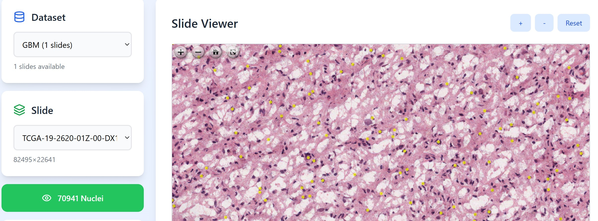
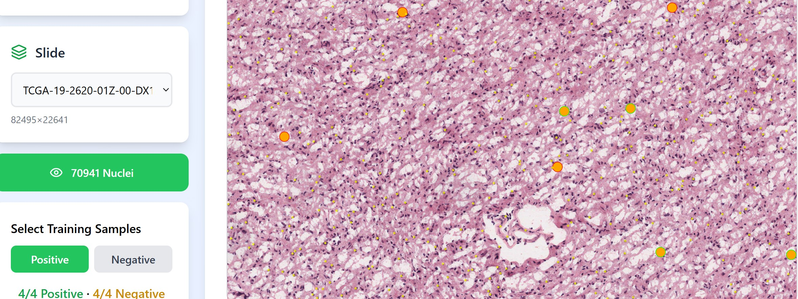
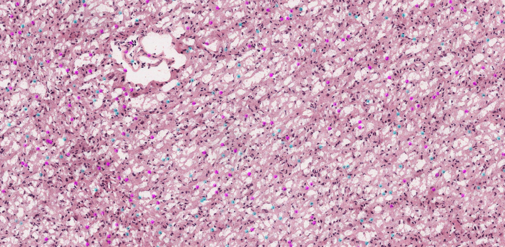
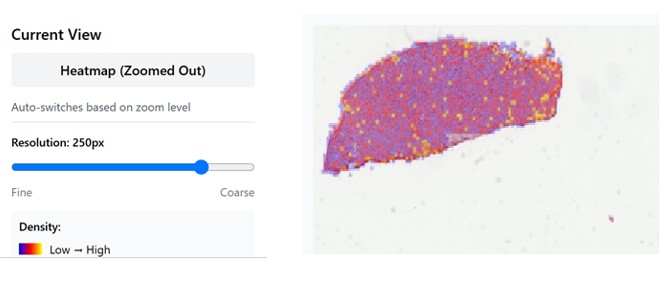
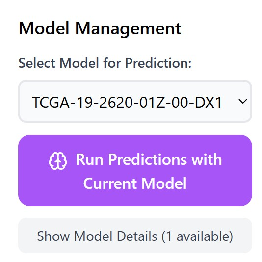

# Using HIMLT

## Workflow

```text
1. Select Dataset      →  GBM
2. Select Slide        →  TCGA-19
3. Click Show Nuclei   →  nuclei boundaries load on image
4. Click Positive      →  click 4 nuclei on image
5. Click Negative      →  click 4 nuclei on image
6. Click Train Model   →  trains in under 1 second
7. View predictions    →  color-coded on all nuclei
8. Repeat steps 4-7    →  refine model (iterative learning)
```

### Image selection and Nuclei View


### Nuclei selection and labelling


## Color Legend

| Marker | Meaning |
|---|---|
| 🟡 Yellow dots | Unselected nucleus |
| 🟠 Orange + green border | Selected positive training sample |
| 🟠 Orange + red border | Selected negative training sample |
| 🟣 Magenta | Predicted positive nucleus |
| 🔵 Cyan | Predicted negative nucleus |



## Heatmap View

Zooming out reveals a full-slide prediction heatmap — a spatial density map
highlighting regions of positive nucleus concentration across the entire
tissue section.

The **Current View** panel automatically switches between individual
prediction dots at high magnification and the heatmap overlay at low
magnification.

- **Resolution** is adjustable from fine to coarse, trading off detail
  against rendering speed.
- The **density colormap** transitions from blue (low density) to yellow
  (high density of predicted cancer-prone regions) — letting pathologists
  instantly spot hotspot regions of interest.

Full-slide prediction and heatmap rendering completes in a matter of
seconds.



## Model Management

HIMLT includes a built-in Model Management panel that allows users to reuse
previously trained models without starting over. The panel displays all
available trained models, showing the slide name, file size, and the date
each model was created.

Each model is automatically tagged:

- **Same Slide** — the model was trained on the currently selected slide,
  confirming it's directly applicable for accurate predictions.
- **Available for Transfer Learning** — the model was trained on a
  different slide, and can still be applied to generate predictions on the
  current slide, leveraging knowledge learned from a different tissue
  section.

To use a saved model, select it from the dropdown and click **Run
Predictions with Current Model** — this immediately generates full-slide
predictions without any re-annotation or retraining.

This makes HIMLT particularly efficient for collaborative research
workflows, where models trained by one team member can be reused across
sessions and across slides.




## Daily Commands

```cmd
cd C:\himlt

:: Start application
docker-compose up -d

:: Stop application
docker-compose down

:: View live logs
docker-compose logs -f

:: Check container status
docker-compose ps
```

### Additional useful commands

```cmd
:: View logs for one service only
docker-compose logs -f web
docker-compose logs -f worker

:: Restart a single service without stopping the rest
docker-compose restart web
```